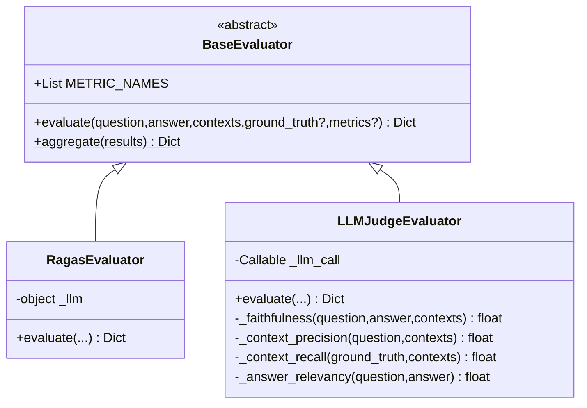
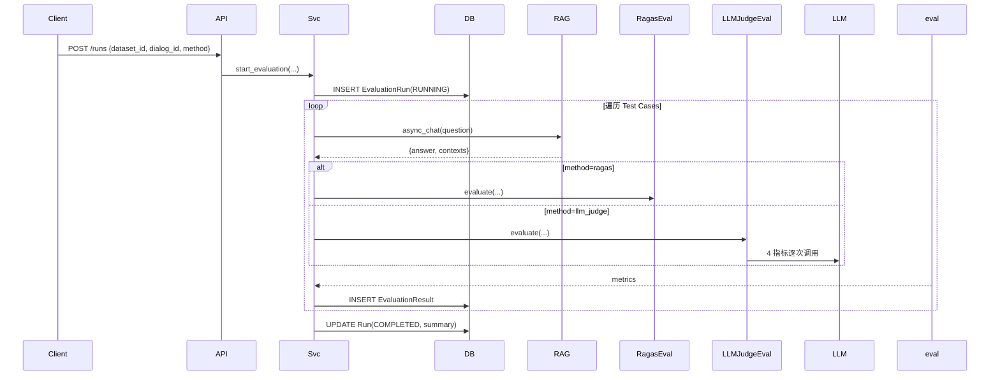

# RAG 评测系统 — 系统架构设计
> v1.0 | 2026-05-22

## 1. 架构分层

```
HTTP API (Quart)        ← evaluation_api.py (14 端点)
Evaluation Core          ← evaluation/ 包
  ├── RagasEvaluator     ← 方案A：封装 ragas 库
  └── LLMJudgeEvaluator  ← 方案B：手工 LLM-as-Judge
Data Layer               ← EvaluationDataset/Case/Run/Result (已有)
```

## 2. 文件清单

### 新建（12 个文件）

| # | 路径 | 说明 |
|---|------|------|
| 1 | `evaluation/__init__.py` | 包导出 |
| 2 | `evaluation/base.py` | BaseEvaluator 抽象类 |
| 3 | `evaluation/prompts.py` | 4 指标 LLM prompt 模板 |
| 4 | `evaluation/ragas_evaluator.py` | RagasEvaluator |
| 5 | `evaluation/llm_judge_evaluator.py` | LLMJudgeEvaluator |
| 6 | `api/apps/restful_apis/evaluation_api.py` | RESTful API |
| 7 | `tests/mock_data/eval_dataset.json` | 10条 mock 数据 |
| 8 | `tests/test_evaluation.py` | 测试脚本 |
| 9 | `evaluation_deps/requirements.txt` | 全部依赖 |
| 10 | `evaluation_deps/requirements-ragas.txt` | 方案A专属 |
| 11 | `evaluation_deps/install.sh` | Linux 安装脚本 |
| 12 | `evaluation_deps/install.bat` | Windows 安装脚本 |

### 修改（1 个文件）

| # | 路径 | 内容 |
|---|------|------|
| 1 | `api/ragflow_server.py` | 注册 evaluation_api blueprint |

## 3. 类图



## 4. 时序图



## 5. 实现顺序

| 阶段 | 任务 | 产出 |
|------|------|------|
| 1-基础 | `__init__.py`, `base.py`, `prompts.py` | 框架和模板 |
| 2-方案B | `llm_judge_evaluator.py` | 手工 LLM 评测 |
| 3-方案A | `ragas_evaluator.py` | RAGAS 集成 |
| 4-API层 | `evaluation_api.py` | HTTP 接口 |
| 5-路由 | 修改 `ragflow_server.py` | Blueprint 注册 |
| 6-测试 | mock 数据 + test_evaluation.py | 验证 |
| 7-依赖 | requirements + install 脚本 | 环境准备 |

## 6. 依赖包

| 文件 | 包列表 |
|------|--------|
| `requirements.txt` | ragas, datasets, langchain, langchain-openai, scikit-learn |
| `requirements-ragas.txt` | ragas>=0.2.0, datasets, langchain, langchain-openai |

## 7. 共享约定

- 指标名：`faithfulness`, `context_precision`, `context_recall`, `answer_relevancy`
- 值域：0.0 ~ 1.0（float）
- 缺少 ground_truth 时 context_recall 返回 None
- LLM 调用异常时该指标返回 None，不阻塞其他指标
- aggregate() 对 None 值跳过该条
